# Software Rasterizer

[](https://hrishikesh-acharyya.github.io/Rasterizer_Simulator/)

A 3D triangle rasterizer written from scratch in C++ — no OpenGL, no Vulkan, no
graphics library of any kind. The only drawing primitive in the whole program is
"write three bytes into an array". Everything above that — perspective
projection, backface culling, the depth test, perspective-correct barycentric
interpolation, Gouraud-shaded lighting, OBJ and MTL loading — is built by hand.

It is not trying to be fast. It is a **reference model**: an executable,
readable definition of what a rasterizer does, stage by stage, so that a
hardware implementation has something to be diffed against. That intent shows up
throughout — in a byte-layout assertion on the pixel struct, in POD types with
predictable flat layout, and in a material table shaped the way hardware wants
one.

**The result: the edge accumulator needs 27 bits — 19 integer plus 2 per
sub-pixel bit at `s = 4`.** The analytical bounds say 22 or 23 integer bits;
measuring 4.33 billion edge evaluations says 19. Three bits of a datapath, on
the widest-running unit in the pipeline, recovered by instrumenting the
reference instead of trusting the bound.

That is what the second rasterizer is for. It sits beside the float one with its
coverage path in **fixed point**, selectable at runtime; the float path is the
golden reference and the fixed path is diffed against it pixel for pixel. The
measurements are committed alongside — 45 exponent histograms and a sub-pixel
sweep across five configurations. Everything below is the evidence:
[the study](#the-fixed-point-study), or
[`Rasterizer_Study.pdf`](Rasterizer_Study.pdf) in full.

## Gallery

| | |
|---|---|
| 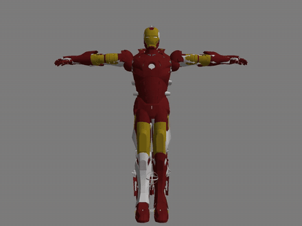<br>**Iron Man** — 129,759 vertices, **217,038 triangles**, 124 `usemtl` blocks naming 9 distinct materials. A downloaded model rather than a generated one, which is the point: it is the first mesh in the repo the loader did not produce itself. | 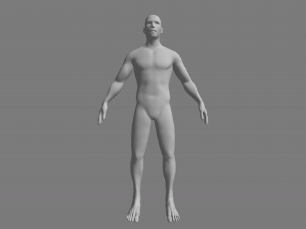<br>**Human figure** — 24,459 faces, one material. Shares vertices throughout, so the averaged normals shade it smooth end to end. |
| 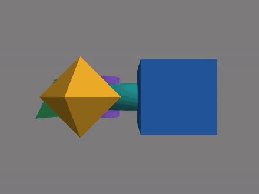<br>**Solids scene** — 3,636 triangles, 7 materials. Flat-faced solids keep their hard edges; the spheres and torus stay smooth. The central torus interpenetrates the ring by ~0.1 units, resolved per pixel by the depth buffer rather than by draw order. | 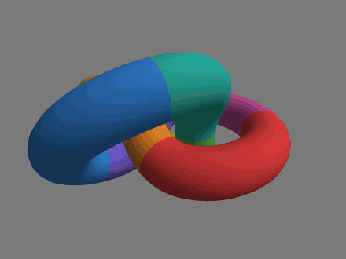<br>**Torus knot** — 12,800 triangles, 8 materials. A (2,3) knot swept by a parallel-transport frame. The crossings occlude each other heavily, which is the depth test doing real work. |

Whether an edge is hard or soft is decided entirely by the mesh, not by a
renderer flag: the flat-faced solids carry per-face duplicated vertices, so
normal averaging has nothing to average across; the curved surfaces share
vertices and average smooth.

The Iron Man model is also the first one to exercise the loader's tolerance
rather than its parsing, and the exact counts are worth being careful about
because blocks and distinct names are not the same thing.

Its MTL has **11 `newmtl` blocks defining 8 distinct materials** — `red` is
defined three times and `14_-_Default` twice, and since the loader keys a
`std::map` by name, the last definition wins. Its OBJ has **124 `usemtl` blocks
naming 9 distinct materials**, one of which (`Iron_man_leg:red`) the MTL never
defines. That single unmatched name appears in six blocks, and the loader prints
its note once per block rather than once per name — so six notes, one missing
material. Each falls back to the neutral light grey default rather than
aborting, which is what the pale pieces are. The palette ends up with 9 entries:
the default at index 0, plus the 8 materials actually referenced and found.

A loader that only ever sees files it generated itself never learns whether it
can survive one it did not.

### Flat shading versus Gouraud

The same icosphere, the same 320 triangles, the same pose and the same light.
Only where the lighting is evaluated changed:

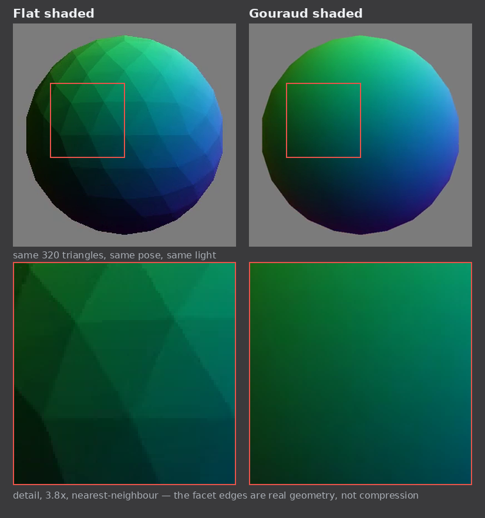

**Flat** evaluates `N·L` once per triangle from that triangle's own face normal,
and fills the whole triangle with the result. Every face is one constant colour,
so every shared edge is a step — visible in the detail as the triangle mesh
itself, drawn in light.

**Gouraud** evaluates `N·L` once per *vertex*, from a normal that is the
area-weighted average of every face meeting there, and lets the rasterizer
interpolate between the three results across the span. Adjacent triangles share
vertices, so they agree on the colour along their shared edge, and the step
disappears.

Three things worth taking from that:

- **The geometry did not change.** Still 320 flat triangles, still a faceted
  silhouette — look at the outline in either panel, which stays polygonal. Only
  the interior shading is smooth. Smooth shading cannot fix a coarse outline; it
  only stops you seeing the facets *within* the surface.
- **It is nearly free.** The rasterizer already interpolated colour across
  triangles for the barycentric fill. Gouraud reuses that machinery unchanged;
  the only added work is the normal-averaging pass, once at load, and three `N·L`
  evaluations per triangle instead of one. Nothing per pixel.
- **The mesh decides, not a flag.** A vertex shared by several faces averages
  across them and comes out smooth. A vertex duplicated per face has only its own
  face to average, so it stays hard — which is why the flat-faced solids in the
  scene above keep crisp edges while the spheres in the same render do not, with
  no per-object setting anywhere.

Phong shading is the next step along this axis: evaluate `N·L` per *fragment*
rather than per vertex, which fixes the remaining error on large triangles where
even the interpolated colour drifts from the true one. That one is not free — it
is a dot product and a normalise on every covered pixel.

In motion, with the earliest render for scale:

| | | |
|---|---|---|
| 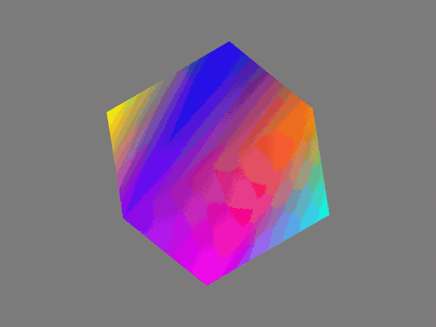<br>**Cube** — 12 triangles, colour interpolated across each face. | <br>**Flat shaded** — one normal per triangle. | 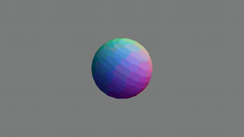<br>**Gouraud shaded** — normals averaged per vertex. |

Full-resolution versions of everything are in [`Media/Videos/`](Media/Videos),
including the before/after pairs for perspective correction and materials.

## Repository layout

```
src/                the renderer; headers sit beside their implementations
  main.cpp          scene setup, render loop, rasterizer selection
  vectors.h         Vec3/Vec4                                   (no dependencies)
  types.h           RGB and screenVertex                        (no dependencies)
  matrices.h        Mat4, transform builders, perspective divide
  model.h/cpp       OBJ + MTL loading, index resolution, bounds
  framebuffer.h/cpp colour + depth buffers, clears, PPM output
  raster.h/cpp      edge function, backface cull, drawTriangle
  raster_fixed.h/cpp  the fixed-point coverage path
  stats.h/cpp       exponent histograms behind a compile-time switch
tools/              standalone programs, each with its own main()
  ppmdiff.cpp       frame-sequence comparison
  plot_sweep.py     draws the sweep figure from the CSVs
stats/              exponent histograms and sweep results (CSV)
Media/              Obj_files, Videos, Gifs, png_files, Graphs
Rasterizer_Study.pdf  the bit-width study written from that data
```

The include graph is kept a DAG on purpose — each `.cpp` compiles in isolation,
which is what a testbench needs. Every edge is a real `#include`, read off the
sources. An arrow reads "includes":

<picture>
  <source media="(prefers-color-scheme: dark)" srcset="Media/Graphs/include_graph_dark.png">
  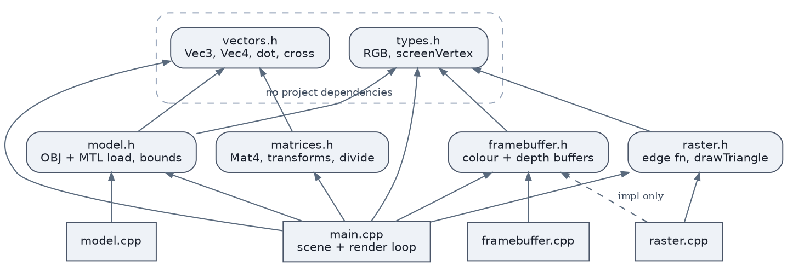
</picture>

`raster.h` deliberately does **not** include `framebuffer.h` — a caller needs to
know what a `screenVertex` is, not that a global framebuffer exists; the `.cpp`
files do, because they write to those globals (the dashed edges). That
separation is what would let the rasterizer be pointed at a caller-supplied
buffer instead of a global. `ppmdiff` is absent from the graph entirely: it
includes no project header, and its only contract with the renderer is the PPM
files on disk, which is what makes it a separate program rather than a module.

---

## How it works

Everything runs on the CPU, single threaded, one triangle at a time.

```
OBJ + MTL
   |  loadOBJ()               parse v/f/mtllib/usemtl, resolve indices,
   |                          fan-triangulate, emit a material index per triangle
   v
model space
   |  vertex normal pass      accumulate unnormalised face normals per vertex
   |  normalise matrix        centre on origin, scale largest axis to 2 units
   |  rotation X * Y * Z      3 degrees per frame, 120 frames = one full turn
   v
world space                   <- N.L evaluated here, per vertex
   |  view matrix             translate -2 on Z; camera at +2 looking down -Z
   |  perspective matrix      60 deg vertical FOV, near 0.1, far 100
   v
clip space
   |  perspectiveTransform()  one reciprocal: x,y,z / w, keeping 1/w
   v
NDC  [-1, 1]
   |  viewport map            -> 1920 x 1080 pixels, Y flipped
   |  snap to 2^-s grid       ONLY when a frac_bits argument was given;
   |                          fills the integer xi/yi beside the floats
   v
screen space
   |
   |  one branch per triangle on g_frac_bits, set once from argv:
   |
   +--> drawTriangle()        FLOAT, the golden reference
   |      backface cull         one signed-area test, first thing in the function
   |      bounding box          clamped to the viewport
   |      3 edge functions      per pixel, at the pixel centre
   |      depth test            interpolated NDC z against the z-buffer
   |      perspective-correct   colour, one reciprocal per surviving fragment
   |
   +--> drawTriangleFixed()   FIXED-POINT COVERAGE, for the study
          backface cull         same rule, but an INTEGER sign test -- no
                                epsilon, no tie-break ambiguity
          bounding box          the SAME function, on the unsnapped floats
          3 edge functions      int64, on the snapped xi/yi, at 2^-s precision
          everything after      copied verbatim from drawTriangle, still float
   v
framebuffer -> writeFramebufferToPPM()
```

Only the *coverage* decision differs between the two paths. Depth, perspective
correction and colour are float in both, so any pixel that disagrees is a
coverage decision that flipped and nothing else — which is what makes the
difference attributable to one cause.

The per-stage reasoning lives in the headers, next to the code it explains, and
is published as browsable HTML with call and include graphs:
**[hrishikesh-acharyya.github.io/Rasterizer_Simulator](https://hrishikesh-acharyya.github.io/Rasterizer_Simulator/)**.
Start at `drawTriangle()` for the heart of it, then `drawTriangleFixed()` for the
same function written the way hardware would have to be.

## Where the work is

<picture>
  <source media="(prefers-color-scheme: dark)" srcset="Media/Graphs/work_amplification_dark.png">
  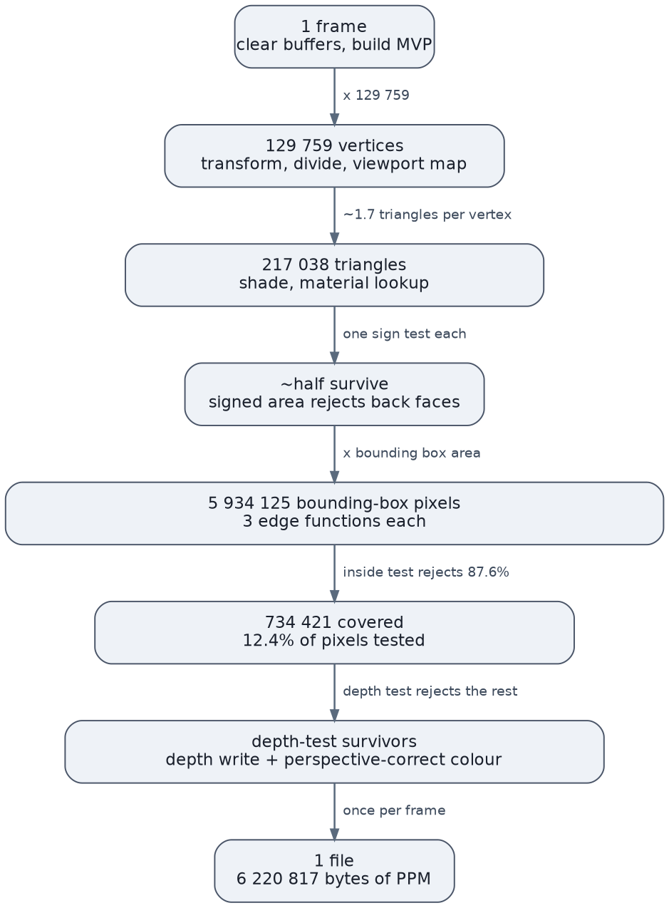
</picture>

Every count is **measured, not estimated** — the figures are histogram totals
from [`stats/`](stats), and the vertex and triangle counts recovered that way
match the loader's own report exactly, which is what makes the other two
trustworthy. Node width is a visual cue, not a linear scale.

**The inside test throws away 87.6% of what the edge functions evaluate** —
nearly six million bounding-box pixels tested per frame to shade 734,421 — which
is why hierarchical coverage rejection is the first optimisation real hardware
reaches for. The cull is the one place the funnel runs backwards: a per-triangle
sign test that removes roughly half the geometry before any per-pixel work
happens. (That "roughly half" is the one figure here *not* measured — `ilogb`
discards sign, so the histograms cannot count negative areas.)

## What it costs

**~75 ms per frame** — 217,038 triangles transformed, culled, shaded and
rasterized into 1920×1080, single threaded, `-O2`.

| Model | Triangles | user | per frame |
|---|---|---|---|
| solids scene | 3,636 | ~2.8 s | ~23 ms |
| Iron Man | 217,038 | ~9.0 s | **~75 ms** |

Sixty times the geometry for three times the time. The vertex stage scales with
the model; the fragment stage scales with *coverage*, and both fill a similar
fraction of the same frame. Past a certain triangle count the pipeline stops
being geometry-bound and the cost sits at the wide end regardless — which is the
reason the wide end is what gets built into fixed-function hardware.

## The fixed-point study

Hardware needs numbers: how many bits does each datapath need? The full
write-up is [`Rasterizer_Study.pdf`](Rasterizer_Study.pdf), with the per-run
notes and every CSV under [`stats/`](stats). The short version:

**How wide?** `stats.h` records `std::ilogb(v)` for nine signals in the float
reference. A value binned at exponent `e` needs `W = e + 2` bits, so the
histogram *is* the bit-width distribution. On the solids scene, over 715 million
edge evaluations: **19 bits overflows on none of them**, 18 bits on 1.00%,
17 bits on 5.82%.

**How many sub-pixel bits?** `drawTriangleFixed` snaps vertices to a `2^-s` grid;
sweeping `s` and diffing each run against the float reference gives the error
curve. The metric is `diff ≥ 2` — a coverage decision that flipped — rather than
the raw pixel count, which is dominated by a `diff = 1` floor from the
truncating `uint8_t` cast that barely moves across the sweep.

<picture>
  <source media="(prefers-color-scheme: dark)" srcset="Media/Graphs/sweep_dark.svg">
  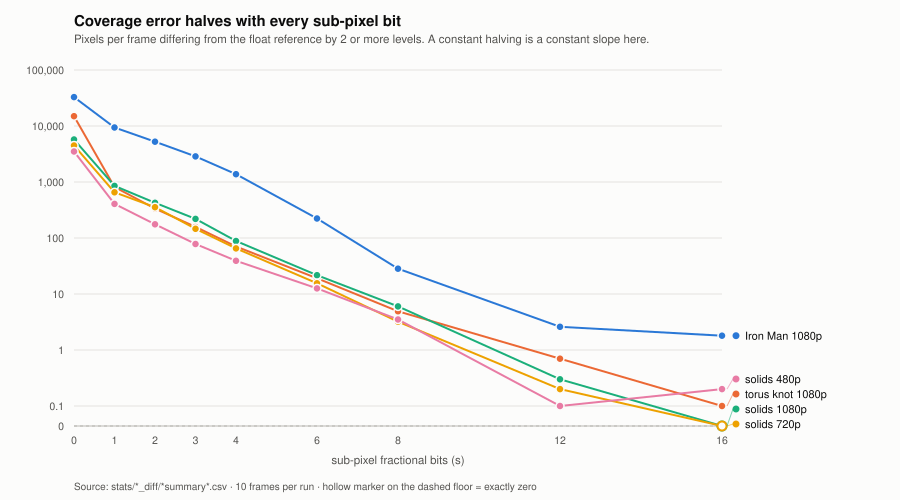
</picture>

Every extra bit halves the error, which on a log axis is the constant slope all
five lines share — 25 measured ratios across three meshes and three resolutions,
all bracketing 2.0. Two configurations reach **exactly zero** at `s = 16`: given
enough precision the fixed path reproduces the golden model's coverage decision
at every pixel of every frame, which is the correctness proof for
`drawTriangleFixed`. The other three floor on coincident geometry rather than on
precision. `s = 0` sits off the curve everywhere, and by construction: with no
fractional bits there is no representation of 0.5, so the sample lands on the
pixel *corner* rather than its centre.

### The answer

```
s = 4  ->  W_edge = 19 + 2s = 27 bits
```

Nineteen integer bits *measured*, against 22 from the geometric bound and 23
from Q propagation — both correct, both loose, because they assume a worst case
the geometry never reaches. 27 fits `int32_t` with five to spare; depth needs
zero integer bits and 16 fractional.

Two findings the analysis could not have given:

- **Required width is uncorrelated with triangle count.** One mesh has 17× the
  triangles of another and needs two more bits, because width tracks the
  *largest* triangle, not the mean.
- **The `diff = 1` floor falls as tessellation rises, then saturates** — and
  proportionally it is *worse* at lower resolution. A lower-resolution hardware
  target has a larger proportional noise floor to budget for.

**The metric cannot see temporal error.** A frame-versus-reference diff cannot
detect edge crawl — an edge snapping between quantised positions as geometry
rotates. Direct3D mandates `s = 8` for that reason where this static metric is
content with 4. Measuring it means diffing consecutive frames of the same run,
which has not been done. `s = 4` answers the question that was asked, not every
question.

## Build and run

Needs a C++17 compiler and nothing else. The Makefile targets Windows and
POSIX from one file, branching on `$(OS)`.

```bash
make            # build BOTH programs: renderer and ppmdiff
make run        # build, clear stale frames, render 120 frames into frames/
make video      # run, then encode an mp4        (needs ffmpeg)
make docs       # doxygen HTML into docs/html/   (needs doxygen + graphviz)
make graphs     # redraw the README figures      (needs graphviz + python3)
make clean
```

`make` builds both programs deliberately: `ppmdiff` is how the renderer's output
gets checked, and letting it drift out of date relative to the renderer it
measures wastes an afternoon.

### Running it

```bash
./renderer          # float golden reference    -> frames/
./renderer 4        # fixed-point coverage, s=4 -> frames_s4/
```

The argument is `s`, the sub-pixel fractional bits, 0–16. Each configuration
writes its own directory, so two runs can never overwrite each other, and the
model, resolution, frame count and `s` are echoed at startup — they are
compile-time constants, so nothing else distinguishes one output directory from
another, and comparing directories from different configurations produces
numbers that look plausible and mean nothing.

The bound of 16 is not arbitrary: the edge accumulator needs `19 + 2s` bits, so
`s = 16` needs 51 and fits `int64_t`, while `s = 22` would need 63 and overflow
silently.

To reproduce a sweep, render the reference and each `s`, then compare:

```bash
./ppmdiff frames frames_s4 10
```

To regenerate the histograms instead, set `HISTOGRAM_STATS` to `1` in
`src/stats.h` and rebuild — and change `STATS_PREFIX` in `src/main.cpp` to match
the model and resolution, or the data is filed under the wrong configuration.

**Paths resolve from the working directory**, so run from the repository root.
**`frames/` gets large**: one 1080p PPM is 6,220,817 bytes and a 120-frame run
writes 746 MB. It is gitignored, and `make run` clears it first.

### Docs and checks

The Doxygen HTML is published to
**[hrishikesh-acharyya.github.io/Rasterizer_Simulator](https://hrishikesh-acharyya.github.io/Rasterizer_Simulator/)**
on every push to `main` touching a source file. That is the only automation
here; there is no build or test workflow, because a build failure surfaces on
the next compile. The checks a CI job would have run are one command each:

```bash
make CXXFLAGS="-std=c++17 -Wall -Wextra -Werror -O2"          # warnings are errors
make CXX=clang++ CXXFLAGS="-std=c++17 -Wall -Wextra -Werror -O2"
make CXXFLAGS="-std=c++17 -g -O1 -fsanitize=address,undefined" && make run
```

The sanitizer pass is the one worth running after touching the loader or the
rasterizer. Two hazards are structural: framebuffer writes are unchecked behind
a bounding box that must be clamped, and OBJ indices are read from a file and
used directly as array subscripts. Both are clean across the full Iron Man
model.

## Known gaps

Deliberately unbuilt, roughly in the order they start to matter:

- **No clipping.** Nothing is clipped against the near plane. A vertex at or
  behind the eye gives `w ≈ 0`, and `perspectiveTransform` returns the origin as
  a placeholder rather than splitting the triangle. Unhit only because the camera
  sits outside the model.
- **No texture coordinates.** Consuming `vt`/`vn` means **unwelding**: every
  distinct `(v, vt, vn)` triple becomes one vertex — the layout a hardware fetch
  unit needs, and a change to the vertex format rather than one more branch in
  the parser.
- **Only `Kd` from the MTL.** `Ka`, `Ks`, `Ns` and the `map_*` lines are skipped
  because the shading model has nowhere to put them. Unlike `vt`, these are cheap
  to add later.
- **Non-uniform scale would break normals.** They are transformed by the world
  matrix, correct only for uniform scale; the general case needs the inverse
  transpose.
- **Out-parameters in the matrix builders.** They return void into a `Mat4&`, so
  a forgotten call leaves stack garbage with no warning.
- **Coordinate parsing on `v` lines is undiagnosed.** Face indices are validated;
  vertex coordinates are not.
- **Single threaded.** Every triangle, every pixel, in order.
- **Only coverage is fixed-point.** Depth, perspective correction and colour
  still run in float in `drawTriangleFixed`. That is a deliberate scope limit —
  it makes every measured difference attributable — but the fixed path is not
  yet a complete model of the hardware.
- **`s` is not validated against the snapping.** `drawTriangleFixed` trusts
  that `xi`/`yi` were filled at the same `s`. A mismatch is not detected and
  produces silently wrong coverage.
- **`STATS_PREFIX` is a manual constant.** Edit it whenever the model or
  resolution changes, or the histograms are filed under the wrong configuration
  with nothing to flag it.

## How it got here

| Commit | Milestone |
|---|---|
| `5f00633`–`282c3e3` | From a flat `vector<RGB>` to a shaded animation: PPM output, the edge function and inside test, barycentric colour, the z-buffer, the perspective divide, rotation matrices, the OBJ loader with fan triangulation, and Gouraud-shaded Lambertian lighting. |
| `95ac44b`–`ef5f2ef` | Split from one 488-line `main.cpp` into six documented modules. |
| `b01b116`–`8800747` | Makefile with incremental build and video targets; `normalizationPass` returns a named `boundingBox` rather than six floats by index. |
| `0c78fcb` | Negative and out-of-range OBJ indices resolved and validated at the loader. |
| `4ad373c` | Backface culling — and the discovery that `torus.obj` was wound inward on all 800 faces. |
| `577eb64` | Perspective-correct attribute interpolation, with `rec_w` carried per vertex. |
| `1c83808` | MTL materials, one index per triangle; torus knot and solids scene added. |
| `3d6e6aa` | First downloaded models — Iron Man and a human figure — rather than generated ones. |
| `7f84287` | `ppmdiff`: frame-sequence comparison with an isolated-pixel count, written *before* the fixed-point path so the metric could not be tuned to flatter it. |
| `437ecbe` | `stats.h`/`stats.cpp`: exponent histograms behind a compile-time switch. |
| `519fac5` | The float rasterizer instrumented — nine signals, no change to its arithmetic. |
| `03df162` | `screenVertex` gains `xi`/`yi`: coordinates snapped once per vertex, so two triangles sharing an edge compute a bit-identical edge function and no crack opens. |
| `7a8c851` | `drawTriangleFixed` — fixed-point coverage beside the float path, not replacing it. |
| `c0922f5` | Rasterizer selected from `argv`, output routed per configuration. |
| `b2101e3` | Sources into `src/`, `ppmdiff` into `tools/`. |
| `3353d5c`–`d370105` | The measurements: 45 histogram CSVs, the sub-pixel sweep across five configurations, and the bit-width report. |
| `dcd1c97` | The ten root sources that move left behind, deleted — the build had been silently preferring the stale copies. |

The stills, from the earliest days:

| | | | |
|---|---|---|---|
|  | 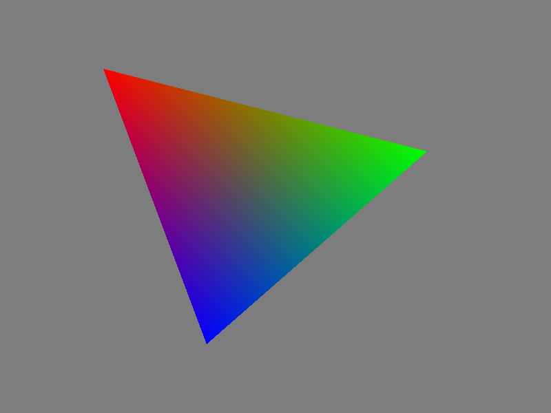 |  | 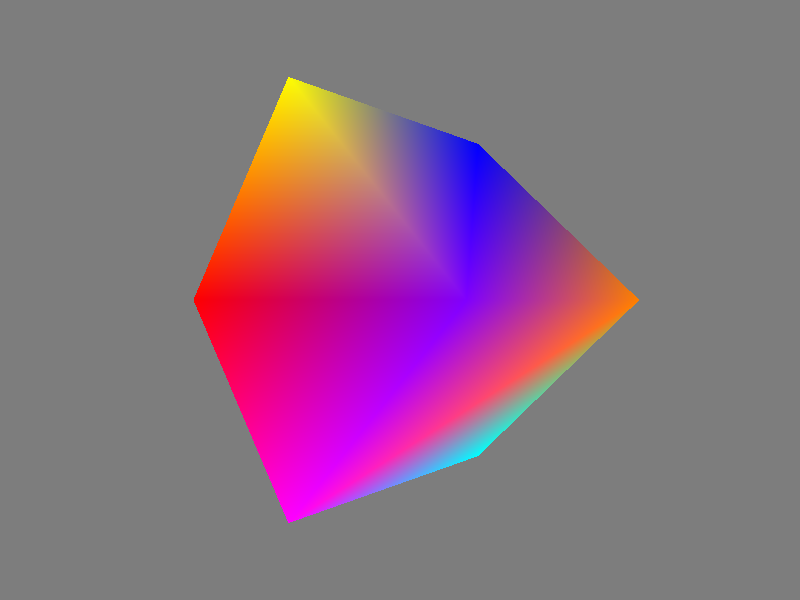 |
| A gradient written straight to a PPM file. | One triangle, filled by the edge function. | Two triangles at different depths — the z-buffer decides. | A cube under perspective projection. |

## Where this is going

The intended destination is an RTL implementation with this program as its
golden reference — same geometry in, framebuffer diffed pixel for pixel. That
target is why several decisions here look over-careful: the byte-layout assert,
the POD structs with flat predictable layout, the dense material table, and the
module split that keeps each stage instantiable on its own.

**The bit-width question is answered**: 27 bits for the edge accumulator at
`s = 4`, zero integer plus 16 fractional for depth. What remains is Verilog, in
its own top-level directory, diffed against these same frames.

One thing has to be settled before that comparison can be written: it has to be
a **tolerance, not an equality**. Building this renderer twice from the same
source and compiler, changing nothing but `-O0` to `-O2`, does not produce the
same image — instruction selection differs, the last bit of a float differs, and
the truncating `uint8_t` cast turns that into a whole level. On a mesh with
near-coplanar surfaces it is worse: a one-LSB difference in interpolated depth
flips *which* triangle wins the depth test, and if the two carry different
materials the pixel changes by a hundred levels rather than one.

So the RTL comparison cannot ask "identical?". It has to ask "how far apart, and
where?", and it has to tell a scatter of tie-breaks on coincident geometry from
a real disagreement — which is what `ppmdiff`'s isolated-pixel count exists to
do, and why it was written before the fixed-point path rather than after.

### Still open

- **Temporal error is unmeasured.** The sweep compares each run against the
  reference frame by frame; it cannot see edge crawl. That is why Direct3D
  mandates `s = 8` where this static metric is content with 4.
- **Depth and colour are still float in the fixed path.** Only coverage was
  converted, deliberately, so that every measured difference is attributable.
  Quantising depth is next, and the `zdiff` histogram was recorded to size it.
- **The cull rate is asserted, not measured.** "Roughly half" is the standard
  figure for a closed mesh, but `ilogb` discards sign, so the committed
  histograms cannot confirm it. It would take one counter.
