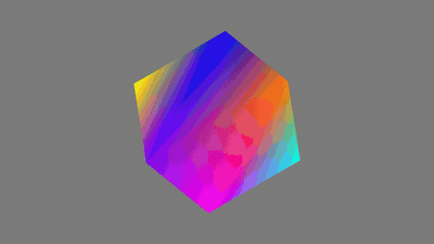
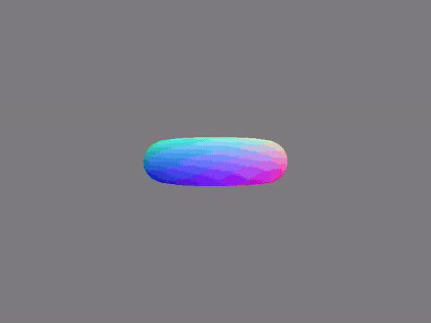
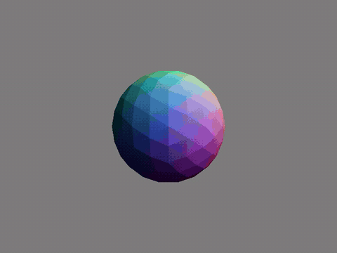
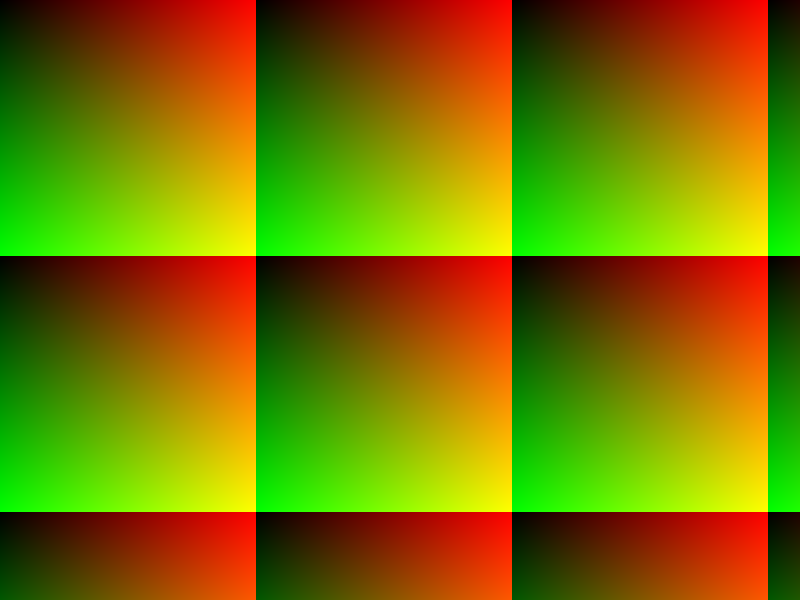
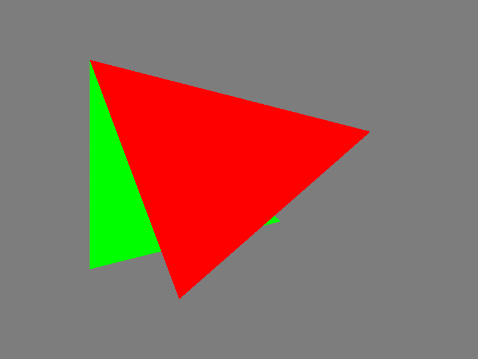

# Software Rasterizer

A 3D triangle rasterizer written from scratch in C++ — no OpenGL, no Vulkan, no
graphics library of any kind. The only drawing primitive in the whole program is
"write three bytes into an array". Everything above that — perspective
projection, the depth test, barycentric interpolation, Lambertian shading — is
built by hand in [`main.cpp`](main.cpp).

The goal is not performance. The goal is to build, stage by stage, the pipeline
that a GPU implements in silicon, so that the hardware makes sense later:
what a vertex shader actually is, why the z-buffer exists, why triangles are
the universal primitive, and where all the parallelism hides.

## Gallery

| | |
|---|---|
| <br>**Spinning cube** — 8 vertices, 12 triangles, vertex colours interpolated across each face. | <br>**Torus, unlit** — loaded from OBJ, coloured by position within its bounding box. |
| <br>**Torus, flat shaded** — one face normal per triangle, `0.2 + 0.8·max(0, N·L)`. | <br>**Icosphere, flat shaded** — the facets are real: shading is per triangle, not per pixel. |

The full-resolution versions are in the repo as `.mp4`.

### The stills, in the order they were made

| | | | |
|---|---|---|---|
|  |  |  |  |
| Framebuffer plumbing: a gradient written straight to a PPM file. | One triangle, filled by the edge function, coloured by barycentric weights. | Two triangles at different depths — the z-buffer decides who wins per pixel. | A cube under perspective projection. |

## The pipeline

Everything runs on the CPU, single threaded, one triangle at a time.

```
OBJ file
   |  loadOBJ()               parse v/f lines, fan-triangulate polygons
   v
model space
   |  normalizationPass()     bounding box -> centre + scale to fit a 2-unit box
   |  rotation X * Y * Z      buildRotationMatrix_{x,y,z}()
   v
world space                   <- face normals + Lambert term computed here
   |  view matrix             fixed translate, camera at z = +4 looking down -z
   |  perspective matrix      buildPerspectiveMatrix(), 60 deg FOV, near 0.1, far 100
   v
clip space
   |  perspectiveTransform()  divide x, y, z by w
   v
NDC  [-1, 1]
   |  viewport map            -> 800 x 600 pixels, y flipped
   v
screen space
   |  drawTriangle()          bounding box -> edge functions -> depth test -> interpolate
   v
framebuffer -> writeFramebufferToPPM()
```

**Rasterization** ([`drawTriangle`](main.cpp)) is the heart of it. For each
triangle it takes the screen-space bounding box, and for every pixel centre
inside that box evaluates three edge functions:

```cpp
float edge_function(float ax, float ay, float bx, float by, float cx, float cy) {
    return (bx - ax) * (cy - ay) - (by - ay) * (cx - ax);
}
```

Each is twice the signed area of a sub-triangle. All three the same sign means
the pixel is inside. Divide each by the full triangle area and they become the
barycentric weights, which are then used for two things: interpolating depth for
the z-test, and interpolating vertex colour for the fill. Same three numbers,
two jobs — which is exactly the trick real hardware uses.

**Shading** is flat: the face normal comes from the cross product of two
world-space edges, the light direction is fixed at normalized `(1, 1, 1)`, and
the resulting intensity scales all three vertex colours before the triangle is
filled. Hence the visible facets on the icosphere — that is the geometry being
honest, not a bug.

## Build and run

Only the standard library is needed.

```bash
g++ -std=c++17 -O2 -Wall -o raster main.cpp
mkdir frames            # writeFramebufferToPPM will not create it
./raster                # raster.exe on Windows
```

The render target is set at the top of `main()` — currently `loadOBJ("torus.obj", ...)`.
Put a `.obj` file with that name next to the executable, or point it at another
one. The commented-out block above it is the hand-written cube, kept as the
minimal case that needs no asset file.

Output is 120 frames of `800x600` binary PPM (P6) in `frames/`. To turn them
into a video and a GIF:

```bash
# frames -> mp4
ffmpeg -framerate 30 -i frames/%03d.ppm -c:v libx264 -pix_fmt yuv420p out.mp4

# mp4 -> gif, via a palette so the gradients survive quantization
ffmpeg -i out.mp4 -vf "fps=20,scale=480:-1:flags=lanczos,palettegen=max_colors=128:stats_mode=diff" palette.png
ffmpeg -i out.mp4 -i palette.png -lavfi "fps=20,scale=480:-1:flags=lanczos[x];[x][1:v]paletteuse=dither=bayer:bayer_scale=3" out.gif
```

A single 800x600 PPM is 1.4 MB and 120 of them is 2.8 GB, so `frames/` and
`*.ppm` are gitignored — only the encoded video and GIF are committed.

## How it got here

| Commit | Milestone |
|---|---|
| `5f00633` | Framebuffer as a flat `vector<RGB>`, `static_assert` that `RGB` is 3 bytes so it can be `fwrite`n straight out. |
| `621e4f8` | Colour map written to a PPM file — proof the bytes land where they should. |
| `83bbe08` | The edge function, the inside test, and a bounding box that is clamped to the screen (an unclamped one indexes past the end of the vector and corrupts memory). |
| `ec5aad4` | Edge function values reused as barycentric weights → smooth colour across a triangle. |
| `52bd7c1` | Z-buffer and depth test, so overlapping triangles resolve per pixel instead of by draw order. |
| `f8b16a8` | Perspective matrix and the divide by `w`. Flat images become 3D. |
| `2629503` | Rotation matrices about X, Y, Z, composed into a model matrix. |
| `9c34965` | 120-frame animation loop with per-frame buffer clears. |
| `1429249` | OBJ loader — `v`/`f` lines, `5/2/3` face tokens, fan triangulation, plus a normalization pass so any model fits the view regardless of its authored scale. |
| `38239af` | Icosphere and torus rendered through the loader. |
| `6c25434` | Face normals and a Lambertian diffuse term with ambient floor. |
| `6d9e865` | Torus under the same lighting. |

## Known gaps

Deliberately unbuilt so far, roughly in the order they start to matter:

- **No clipping.** Nothing is clipped against the near plane. A vertex at or
  behind the camera produces a `w` near zero, and `perspectiveTransform` just
  zeroes it out rather than splitting the triangle. Works only because the
  camera never gets close.
- **Interpolation is affine, not perspective correct.** Barycentric weights are
  computed in screen space and applied directly to colour and depth. Correct
  values need the weights divided by `w` per vertex and renormalized. Invisible
  on small, distant models; obvious on a large tilted one.
- **No backface culling.** The inside test accepts either winding, so back faces
  are rasterized and then thrown away by the depth test — roughly twice the
  fragment work needed.
- **Flat shading only.** Per-vertex normals and interpolation across the face
  (Gouraud, then Phong) are the next step; the OBJ loader already skips `vn`
  lines that would provide them.
- **Single threaded.** Every triangle, every pixel, in order. Which is the whole
  point of what comes next.

## Where this is going

The rasterizer is the software half of a hardware question. Having written the
pipeline by hand, the interesting part is what a GPU does differently: why
fragment work is embarrassingly parallel, how SIMD lanes map onto pixel quads,
what a warp is, why memory bandwidth and not arithmetic is the wall, and how the
z-buffer and framebuffer become concrete memory hierarchy problems.

That is the reading track this repo feeds into — Hennessy and Patterson, and the
chapters on data-level parallelism and GPU architecture in particular.
