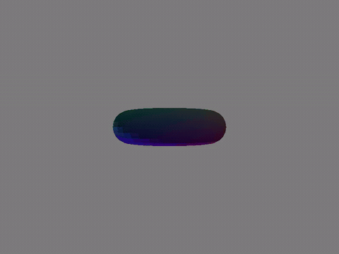
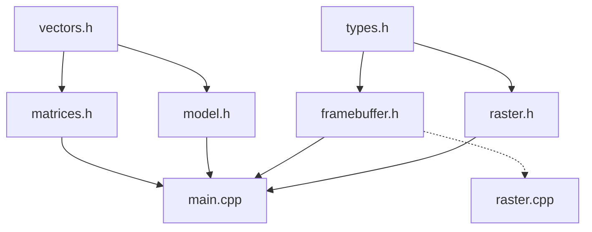

# Software Rasterizer

A 3D triangle rasterizer written from scratch in C++ — no OpenGL, no Vulkan, no
graphics library of any kind. The only drawing primitive in the whole program is
"write three bytes into an array". Everything above that — perspective
projection, the depth test, barycentric coverage, Gouraud-shaded lighting — is
built by hand.

It is not trying to be fast. It is a **reference model**: an executable,
readable definition of what a rasterizer does, stage by stage, so that the
hardware version has something to be diffed against. The design notes in the
headers are written with that in mind — why `RGB` must be exactly three bytes,
why the perspective divide is the one expensive operation in an otherwise pure
multiply-add pipeline, why depth traffic and not arithmetic is what makes a GPU
a memory-bandwidth problem.

## Gallery

| | |
|---|---|
| <br>**Spinning cube** — 8 vertices, 12 triangles, vertex colours interpolated across each face. | <br>**Torus, unlit** — loaded from OBJ, coloured by position within its bounding box. |
| <br>**Icosphere, flat shaded** — one normal per triangle. The facets are the geometry being honest. | <br>**Icosphere, Gouraud shaded** — same 320 triangles, normals averaged per vertex and interpolated across the face. |
| <br>**Torus, flat shaded** — visible banding along every triangle edge. | <br>**Torus, Gouraud shaded** — the banding is gone without adding a single triangle. |

The two right-hand renders are the whole argument for per-vertex normals: the
mesh is identical, only where the lighting is evaluated changed. Full-resolution
versions are in [`Media/Videos/`](Media/Videos).

### Earlier stills, in the order they were made

| | | | |
|---|---|---|---|
|  |  |  |  |
| Framebuffer plumbing: a gradient written straight to a PPM file. | One triangle, filled by the edge function, coloured by barycentric weights. | Two triangles at different depths — the z-buffer decides per pixel. | A cube under perspective projection. |

## Repository layout

```
main.cpp          scene setup and the per-frame render loop
vectors.h         Vec3/Vec4 and pure vector arithmetic          (no dependencies)
matrices.h        Mat4, transform builders, perspective divide
types.h           RGB and screenVertex                          (no dependencies)
framebuffer.h/cpp colour + depth buffers, clears, PPM output
raster.h/cpp      edge function, bounding box, drawTriangle
model.h/cpp       OBJ loader and bounding-box measurement
Makefile          build, render, encode video/GIF, build docs
Doxyfile          optional HTML docs from the header comments
Media/            Obj_files, Videos, Gifs, png_files
```

The include graph is kept a DAG on purpose — each `.cpp` can be compiled and
tested in isolation, which is what a testbench needs. `make docs` draws this
per file and in both directions; the summary is:



`vectors.h` and `types.h` sit at the bottom and include nothing from the
project. `raster.h` deliberately does not include `framebuffer.h` — a caller
needs to know what a `screenVertex` is, not that a global framebuffer exists.
`raster.cpp` does include it, because the implementation writes to those
globals. Interface and binding are different edges, and separating them is what
would let the rasterizer be pointed at a caller-supplied buffer later.

## The pipeline

Everything runs on the CPU, single threaded, one triangle at a time.

```
OBJ file
   |  loadOBJ()               parse v/f lines, fan-triangulate polygons
   v
model space
   |  vertex normal pass      accumulate unnormalised face normals per vertex,
   |                          normalise once at the end (area-weighted average)
   |  normalise matrix        centre on origin, scale largest axis to 2 units
   |  rotation X * Y * Z      3 degrees per frame, 120 frames = one full turn
   v
world space                   <- N.L evaluated here, per vertex
   |  view matrix             translate -4 on Z; camera at +4 looking down -Z
   |  perspective matrix      60 deg vertical FOV, near 0.1, far 100
   v
clip space
   |  perspectiveTransform()  one reciprocal, three multiplies: x,y,z / w
   v
NDC  [-1, 1]
   |  viewport map            -> 1920 x 1080 pixels, Y flipped
   v
screen space
   |  drawTriangle()          bounding box -> edge functions -> depth test
   |                          -> barycentric colour interpolation
   v
framebuffer -> writeFramebufferToPPM()
```

The vertex loop runs 800 times per frame, the triangle loop 1600 times, and the
rasterizer's inner loop once per covered pixel — millions. That widening ratio
is the shape of the whole problem, and it is why the fixed-function hardware
sits at the wide end.

### Coverage

For each triangle, `drawTriangle` walks the screen-space bounding box and
evaluates three edge functions at every pixel centre:

```cpp
float edge_function(float ax, float ay, float bx, float by, float cx, float cy) {
    return (bx - ax) * (cy - ay) - (by - ay) * (cx - ax);
}
```

Each result is twice the signed area of a sub-triangle. All three the same sign
means the pixel is inside. Divide each by the full triangle area and the same
three numbers become the barycentric weights, used for two things: interpolating
depth for the z-test, and interpolating vertex colour for the fill. One
computation, three jobs — which is exactly why real hardware is built around it.

### Shading

Lighting is evaluated **per vertex** (Gouraud), not per face:

1. Before the render loop, each triangle's face normal is added to all three of
   its vertices. The normals are accumulated **unnormalised**, so each face
   contributes in proportion to its area — the cross product's magnitude carries
   that for free. Normalising inside the loop would weight a sliver the same as
   a large quad.
2. Each vertex normal is normalised once, after all contributions are summed.
3. Per frame, normals are transformed by the world matrix with `w = 0`, because
   translating a direction is meaningless.
4. `intensity = 0.4 + 0.6 · max(0, N·L)`, evaluated three times per triangle.
   The rasterizer interpolates the resulting colours across the face.

Phong shading would move step 4 into the inner loop — one `N·L` per *fragment*
instead of per vertex, far more accurate on large triangles and far more
expensive. That trade is the next thing worth measuring.

## Build and run

Needs a C++17 compiler and nothing else. The Makefile works on Windows
(cmd.exe + MinGW `mingw32-make`) and on Linux/macOS; it selects the right shell
and file-removal commands from `$(OS)`.

```bash
make            # build -> renderer (renderer.exe on Windows)
make run        # build, clear stale frames, render 120 frames into frames/
make video      # run, then encode Media/Videos/torus_gouraud_shading.mp4
make gif        # run, then encode Media/Gifs/torus_gouraud_shading.gif
make docs       # doxygen HTML into docs/html/index.html  (optional)
make clean      # remove objects and the executable
```

`make video` and `make gif` need `ffmpeg` on `PATH`. `make docs` needs
`doxygen`, plus `graphviz` for the graphs (`winget install Graphviz.Graphviz`,
`apt install graphviz`, `brew install graphviz`) — set `HAVE_DOT = NO` in the
`Doxyfile` to build the HTML without them. None of it is required to build or
render.

The generated docs are worth the two-minute install: alongside the prose from
the headers, Doxygen draws the **include graph** for every file (both
directions — what it pulls in, and what depends on it), a **collaboration
graph** per struct, and a **call/caller graph** per function. The last one is
the useful one here: it shows the fan-out from the render loop down to the
per-pixel inner loop, which is the same fan-out the hardware has to pipeline.
Output lands in `docs/html/index.html`; `docs/` is gitignored.

Without make:

```bash
g++ -std=c++17 -Wall -Wextra -O2 main.cpp framebuffer.cpp raster.cpp model.cpp -o renderer
mkdir frames
./renderer
```

**Paths are resolved from the working directory**, not from the executable, so
run from the repository root — `main.cpp` loads `Media/Obj_files/torus.obj`.
Change that one line to swap models; `icosphere.obj` and `test.obj` (a cube) are
there too.

**`frames/` gets large.** At 1920×1080 a single P6 PPM is 6.2 MB and a 120-frame
run writes **713 MB**. It is gitignored along with `*.ppm`, and `make run` clears
it first — a leftover frame that the new run does not overwrite would silently
appear in the video and look like a rendering bug.

### Measured cost

A full 120-frame run of the torus (1600 triangles, 1920×1080, `-O2`, single
thread, Linux container):

| | |
|---|---|
| wall clock | ~5.1 s |
| user (transform + raster) | ~0.9 s → **~7 ms/frame** |
| system (writing 713 MB of PPM) | ~4.2 s |

Roughly 80% of the run is file I/O. Worth knowing before optimising the inner
loop: at this resolution the renderer is bound by getting bytes out, not by
computing them. The same shape shows up one level down — every fragment costs a
depth read, and only survivors cost a depth write plus a colour write, with no
reuse between them. Streaming, not caching. That traffic is why real hardware
spends transistors on hierarchical-Z and depth compression rather than on more
ALUs.

## Known gaps

Deliberately unbuilt, roughly in the order they start to matter:

- **No clipping.** Nothing is clipped against the near plane. A vertex at or
  behind the eye gives `w ≈ 0`, and `perspectiveTransform` returns the origin
  as a placeholder rather than splitting the triangle. Unhit only because the
  camera sits outside the model; it breaks the moment the camera moves inside
  one.
- **Interpolation is affine, not perspective correct.** Barycentric weights are
  computed in screen space and applied directly to colour and depth. Correct
  values need per-vertex division by `w` and renormalisation. Invisible on small
  centred models, obvious on a large tilted one.
- **No backface culling.** The inside test accepts either winding, so back faces
  are rasterized and then discarded by the depth test — roughly twice the
  fragment work needed. The sign of the triangle area is already computed and is
  exactly the test that would cull them.
- **Vertex colour is a placeholder.** Position within the bounding box mapped to
  RGB, so geometry is legible without materials. MTL `Kd` parsing is the real
  answer.
- **Non-uniform scale would break normals.** They are transformed by the world
  matrix, which is only correct for uniform scale; the general case needs the
  inverse transpose. Currently harmless, since the only scale applied is uniform.
- **Out-parameters and magic indices.** The matrix builders take `Mat4&` and
  return void, so a forgotten call leaves stack garbage with no warning;
  `normalizationPass` returns six floats addressed by number, where a wrong
  index yields a wrong render rather than an error. Both are deferred on
  purpose — the file split was verified as a no-op first — and both are worth
  fixing before the interfaces get frozen against a testbench.
- **Single threaded.** Every triangle, every pixel, in order. Which is the whole
  point of what comes next.

## How it got here

| Commit | Milestone |
|---|---|
| `5f00633` | Framebuffer as a flat `vector<RGB>`, with a `static_assert` that `RGB` is 3 bytes so it can be `fwrite`n straight out. |
| `621e4f8` | Colour map written to a PPM file — proof the bytes land where they should. |
| `83bbe08` | Edge function, inside test, and a bounding box clamped to the viewport (an unclamped one indexes past the end of the vector). |
| `ec5aad4` | Edge function values reused as barycentric weights → smooth colour across a triangle. |
| `52bd7c1` | Z-buffer and depth test: overlapping triangles resolve per pixel instead of by draw order. |
| `f8b16a8` | Perspective matrix and the divide by `w`. Flat images become 3D. |
| `2629503` | Rotation matrices about X, Y, Z, composed into a model matrix. |
| `9c34965` | 120-frame animation loop with per-frame buffer clears. |
| `1429249` | OBJ loader — `v`/`f` lines, `5/2/3` face tokens, fan triangulation, plus a normalisation pass so any model fits the view. |
| `38239af` | Icosphere and torus rendered through the loader. |
| `6c25434` | Face normals and a Lambertian diffuse term with an ambient floor. |
| `282c3e3` | Gouraud shading: area-weighted per-vertex normals, lighting evaluated per vertex. |
| `95ac44b`–`ef5f2ef` | Split from one 488-line `main.cpp` into vectors / matrices / types / framebuffer / raster / model, each documented with its rationale. |
| `b01b116` | Makefile: incremental build, render, video and GIF targets. |

## Where this is going

The rasterizer is the software half of a hardware question. Having written the
pipeline by hand, the interesting part is what a GPU does differently: why
fragment work is embarrassingly parallel, how SIMD lanes map onto pixel quads,
why a fixed-point depth buffer has to budget its bits around the non-uniform
precision of `1/z`, and where the bandwidth actually goes.

The intended destination is an RTL implementation with this program as its
golden reference — same geometry in, framebuffer diffed pixel for pixel. That
target is why several decisions here look over-careful: the byte-layout assert
on `RGB`, the POD structs with predictable flat layout, the flagged spots where
a float pipeline will have to become a fixed-point one, and the header split
that keeps each stage instantiable on its own.
